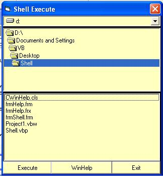



## Shell for beginners

### Description

Acess files and execute them if you like than please vote......
 
### More Info
 
Running exe files from vb

             |
---                |---
**Submitted On**   |2001-12-06 19:29:38
**By**             |[Terry](https://github.com/Planet-Source-Code/PSCIndex/blob/master/ByAuthor/terry.md)
**Level**          |Intermediate
**User Rating**    |5.0 (10 globes from 2 users)
**Compatibility**  |VB 6\.0
**Category**       |[Files/ File Controls/ Input/ Output](https://github.com/Planet-Source-Code/PSCIndex/blob/master/ByCategory/files-file-controls-input-output__1-3.md)
**World**          |[Visual Basic](https://github.com/Planet-Source-Code/PSCIndex/blob/master/ByWorld/visual-basic.md)
**Archive File**   |[Shell\_for\_399141262001\.zip](https://github.com/Planet-Source-Code/terry-shell-for-beginners__1-29537/archive/master.zip)

